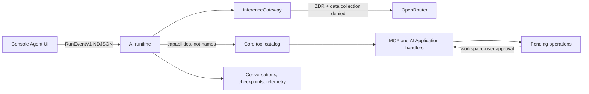

# AI runtime operations

This runbook governs model profiles, OpenRouter providers, release, rollback,
telemetry retention, the breaking MCP catalog, and the pre-launch data reset.
It is the release source of truth; runtime configuration and generated API docs
remain authoritative for individual fields and routes.

## Runtime boundary



OpenRouter is the only runtime path for text and tool inference. The direct
OpenAI credential is embeddings-only. Browser code consumes only `RunEventV1`;
provider events,
LangChain events, raw responses, tool payload internals, and reasoning details
remain server-side.

## Model-profile review

The reviewed profile lives in `ai/src/inference/profiles.ts` and is exposed
read-only at `GET /api/info/model-profile`. A profile change must:

1. Change the profile version.
2. Use only the fixed candidate matrix in the evaluation report.
3. Attach a prompt-free evaluation artifact containing task IDs, scores,
   safety flags, latency, token counts, and actual OpenRouter cost.
4. Keep prompts, responses, reasoning, and tool payloads out of the artifact.
5. Pass the promotion function and receive security review for tool and
   authorization cases.

The gate rejects safety or tool-authorization regression, task success more
than two percentage points below baseline, median cost reduction below 40%, or
p95 latency more than 20% above baseline. Among qualifiers, task success wins;
within one point, lower cost wins. Without a qualifying artifact, the active
profile remains Claude Sonnet 4.6 through OpenRouter and carries no unevaluated
fallback model.

## ZDR provider admission

Adding a provider requires a Git-reviewed record with every field below. The
provider may enter `OPENROUTER_PROVIDER_ALLOWLIST` only after that record and
the profile change are approved.

| Field | Required evidence |
| --- | --- |
| Provider identity | OpenRouter provider name and owning legal entity |
| Operator | Internal owner responsible for the configuration |
| ZDR evidence | Dated source proving zero-data-retention behavior |
| Data collection | Evidence that collection can be denied |
| Review date | Date of the security/privacy review |
| Capabilities | Tools, structured output, reasoning, context, and parameter support |
| Rollback owner | Person responsible for disabling the provider/profile |

The runtime rejects an allowlisted provider not present in the reviewed
version-controlled set. Provider fallbacks are disabled; fallback models and
providers must be explicit in a reviewed profile.

## Promotion release and rollback

Promoted profiles ship through the normal Git-reviewed application release.
Advance only when failure, cancellation, malformed-stream, missing-usage,
quality, authorization, cost, and p95 latency evidence remains within the
approved envelope. Roll back by reverting to the previous reviewed profile or
application release; rollback still routes through OpenRouter. Direct provider
credentials and runtime backend switches are not supported.

## Telemetry and billing

Customer billing remains request-based in Core `ai_requests`. Model telemetry
does not change customer quotas or invoices.

`model_runs` retains prompt-free run detail: HTTP parent run, model-call,
conversation, and workspace IDs,
role and profile, requested/resolved model and provider, terminal status,
fallback index, tokens, exact OpenRouter cost, latency, time to first token, and
timestamps. It never stores prompts, tool payloads, model responses, or
reasoning.

Run this daily after setting the desired retention window (default 90 days):

```bash
cd ai
MODEL_RUN_RETENTION_DAYS=90 pnpm telemetry:prune
```

The command atomically rolls eligible rows into `model_run_daily_metrics`
before deleting detail. Daily metrics retain no user, conversation, prompt,
response, reasoning, or tool-payload data and may be kept for longer-lived
operational trend analysis.

Alert on missing usage, cost, or resolved provider. Cost is never estimated;
OpenRouter response/generation usage is authoritative.

## Breaking tool catalog

Core `toolregistry.Descriptor` is the single tool source for MCP registration,
AI Application execution, prompt documentation, Console metadata, workspace
catalog responses, risk policy, timeouts, cancellation, and redaction. Tool
names use `irmin_<domain>_<action>` and schemas reject additional properties.
There are no aliases for the replaced names.

Ordinary writes follow the AI Application's explicit approval setting. AI
Application destructive operations always stage. Approval is an atomic state
transition available only to authenticated workspace users; duplicate approval
conflicts, and AI Application credentials cannot self-approve.

The user MCP endpoint stages destructive calls in `mcp_pending_operations`
instead of invoking their handlers. The run protocol emits the opaque operation
ID and descriptor approval preview; an authenticated workspace user can approve
or reject it from the chat. Approval claims the operation once and replays the
registered handler with an internal approval context. Machine and AI
Application credentials cannot approve their own operations.

## Release order

The catalog change is intentionally breaking, so deploy during a coordinated
pre-launch maintenance window:

1. Back up both PostgreSQL databases and record the active profile version.
2. Deploy Core with the canonical catalog and pending-operation routes.
3. Apply AI Drizzle migrations, then deploy AI with the matching catalog
   client and reviewed model profile.
4. Deploy Console with `RunEventV1` and pending-operation contracts.
5. Run the guarded reset below, then require new conversations.
6. Smoke-test the model profile and OpenRouter ZDR route, catalog listing,
   agent streaming, cancellation,
   AI Application destructive approval, feedback reload, and conversation deletion.
7. Schedule daily telemetry rollup/pruning and monitor the release gates.

## Guarded pre-launch reset

These commands permanently delete pre-launch AI state. They refuse to run
without the exact acknowledgement and are safe to repeat after successful
completion.

```bash
cd ai
IRMIN_PRELAUNCH_RESET_ACK=RESET_IRMIN_PRELAUNCH_AI_DATA \
  pnpm db:reset:prelaunch-ai

cd ../core
IRMIN_PRELAUNCH_RESET_ACK=RESET_IRMIN_PRELAUNCH_AI_DATA \
  go run . -reset-prelaunch-ai-data
```

The AI command deletes conversations and all relationally linked runs/feedback,
then clears LangGraph checkpoints. The Core command clears pending operations,
removes obsolete pending-write storage, and exits. Do not place the
acknowledgement in a persistent environment file.

## Validation and release evidence

Run the hermetic gates on every change:

```bash
make validate
make validate-ai
make validate-console
```

Run focused Core registry/MCP tests for descriptor changes and `make test-core`
in the documented integration environment before merging the registry
replacement. Live OpenRouter evaluation is opt-in, credentialed, and excluded
from hermetic CI. The current evaluation decision is recorded in
`ai/evals/model-promotion-2026-08.md`.
